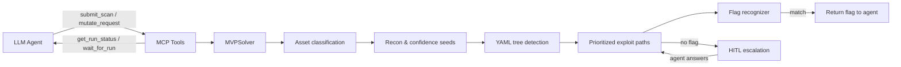

# Lattice Mind — MCP-native CTF exploitation toolkit for LLM agents

Lattice Mind is an MCP (Model Context Protocol) server that gives LLM agents a complete, automated vulnerability discovery and exploitation pipeline. The agent does not need to run scans, manage HTTP sessions, or iterate over payloads manually — Lattice Mind handles all of that deterministically. The agent's job is to **direct and augment**: submit a target, monitor progress via the MCP tools, and step in to mutate requests, inject session cookies, or answer escalation questions when the automated engine needs higher-level reasoning.

**What runs automatically (no LLM needed):**
- Asset classification, web recon, technology fingerprinting
- YAML-tree-driven detection (HTTP probing, signal evaluation, confidence scoring)
- Exploit payload permutation and flag capture

**What the LLM agent does:**
- Submits challenges and monitors run progress via MCP tools
- Mutates in-flight requests (headers, body, params) when the automated engine surfaces a promising signal
- Injects or rotates session cookies/tokens mid-scan
- Selects specific YAML attack trees to run for targeted assessments
- Answers HITL escalation questions when automation is insufficient

Every automated action is rule-driven and reproducible; every LLM intervention is explicitly tracked via `run_id` and recorded in the execution log.

## Quickstart

### Docker (local development or DigitalOcean deployment)

1. Build the container image with all bundled tools:

   ```powershell
   docker compose build lattice-mind-api
   ```

2. Start the service (runs the API, dashboard, and solver engine):

   ```powershell
   docker compose up -d
   ```

3. Confirm the service is healthy:

   ```powershell
   curl http://localhost:8000/health
   ```

4. Submit a challenge via the API or dashboard (`http://localhost:8000`), e.g.:

   ```http
   POST /solve
   Content-Type: application/json

   {
     "name": "Bank Login",
     "challenge_type": "web",
     "url": "http://target.com:8080",
     "flag_format": "flag{...}"
   }
   ```

5. Tail the logs to observe progress:

   ```powershell
   docker compose logs -f lattice-mind-api
   ```

   The logs show decision nodes, payloads, captured confidence, and any flag recognition events.

When deploying to DigitalOcean, build the same Docker image and push it to your container registry; the compose file can be used inside a droplet or managed App Platform by providing port 8000 and persistence for `/data`.

### Local (source)

1. Install dependencies:

   ```powershell
   python -m pip install -e .
   ```

2. Run the API:

   ```powershell
   uvicorn lattice_mind.api.server:app --host 0.0.0.0 --port 8000
   ```

   Run one API worker per database. The solver and restart recovery are
   intentionally single-worker; startup fails clearly if another process is
   already using the configured `LATTICE_MIND_DB`.

3. Open `http://localhost:8000` to interact with the dashboard or issue `Lattice-Mind` CLI commands.

### Authentication and roles

Public registration creates an `operator`. Operators can access only the runs they create. To bootstrap the first administrator, set a strong `LATTICE_MIND_BOOTSTRAP_TOKEN` environment variable and include `admin_bootstrap_token` in the first `POST /auth/register` request. Global rule, settings, and strategy-memory mutations require the `admin` role. Password-reset links are signed, expire after 30 minutes, and become invalid after a password change.

## MCP integration (for AI tools)

Lattice Mind now ships a stdio MCP server so any MCP-compatible AI client can queue scans and read decision-tree results.

1. Start the API service (local or Docker) and ensure authentication token access if your API is protected.
2. Launch MCP server:

   ```powershell
   Lattice-Mind-mcp
   ```

3. Configure your MCP client to run that command and pass environment variables as needed:

   - `LATTICE_MIND_API_BASE_URL` (default `http://127.0.0.1:8000`)
   - `LATTICE_MIND_MCP_TOKEN` (Bearer token for protected API routes)
   - `LATTICE_MIND_MCP_TIMEOUT` (HTTP timeout in seconds, default `30`)

When using Docker Compose, MCP now starts automatically with the API:

- Default dev (hot reload): `docker compose up -d`
- Production profile: `docker compose --profile prod up -d`

The `lattice-mind-api` / `lattice-mind-dev` containers run both processes together (web UI/API + MCP) and preconfigure `LATTICE_MIND_API_BASE_URL` to `http://127.0.0.1:8000` inside the container.

In the web UI header, use **SHOW TOKEN** after login to reveal/hide the current JWT for `LATTICE_MIND_MCP_TOKEN`.

### Exposed MCP tools

The server exposes 20 tools covering authentication, scan submission and waiting, run/rule inspection, targeted tree execution, session rotation, request interception, and mutation history. Use `tools/list` for the authoritative schemas.

## Architecture

Lattice Mind is composed of the following layers:

1. **MCP interface** — `lattice_mind/mcp/server.py` exposes 20 tools over stdio JSON-RPC 2.0 (also available at `POST /mcp`). This is the primary surface an LLM agent interacts with: submit scans, poll progress, inspect results, and mutate in-flight requests.
2. **Core orchestration** — `lattice_mind/core/` defines shared data types (`ChallengeDescriptor`, `NodeResult`), the DecisionNode base class, the orchestrator, and the flag recognizer.
3. **Adapters** — Tool adapters (curl, ffuf, nmap, etc.) wrap command-line utilities to emit normalized JSON so decision nodes can reason about structured observations.
4. **Decision trees** — Split between Python nodes (`trees/`) and YAML-driven trees (`lattice_mind/trees/yaml/`). Detection and exploitation paths read context, emit confidence boosts, and branch deterministically.
5. **Execution engine** — `lattice_mind/core/executor.py` drives YAML trees, runs HTTP probes, applies exploit payloads, and checks flag patterns after every response.
6. **API + UI** — `lattice_mind/api/server.py` exposes REST endpoints, persists run history (SQLite), and hosts the cyberpunk dashboard for live tree playback and HITL question answering.



## File Structure (high-level)

| Path | Purpose |
|------|---------|
| `lattice_mind/core/` | Shared orchestration logic, flag recognition, node abstractions, knowledge base. |
| `lattice_mind/adapters/` | Tool adapters (curl, ffuf, nmap, gdb wrappers) that return structured dictionaries. |
| `lattice_mind/trees/` | Python asset classification and web reconnaissance nodes. |
| `lattice_mind/trees/yaml/` | YAML-based detection/exploitation definitions (plug-and-play). |
| `lattice_mind/api/` | FastAPI server and REST endpoints. |
| `lattice_mind/frontend/` | Packaged dashboard static assets. |
| `lattice_mind/templates/` | Exploit helper templates consumed by nodes. |
| `lattice_mind/config.py` | Global constants, tool paths, and feature flags. |
| `lattice_mind/mvp.py` | Top-level solver loop for classification, recon, and YAML dispatch. |

## How it works

1. **Agent submits a challenge** — The LLM agent calls `submit_scan` via MCP with a `ChallengeDescriptor` (type, URL/file, flag format, metadata). This returns a `run_id`.
2. **Automated asset classification** — The engine classifies the challenge (web/pwn/crypto/forensics) without agent involvement.
3. **Automated recon & confidence seeding** — Recon nodes populate context (paths, params, tech stack). Each YAML tree's `applies_when` guards and `confidence_seeds` are evaluated to score and rank applicable trees.
4. **Automated YAML tree dispatch** — Detection paths run HTTP probes with payload permutations, check response signals, and emit named events that unlock exploitation paths. All of this runs without agent intervention.
5. **Agent augmentation points** — At any point during a run, the agent can:
   - Call `set_session_cookies` to inject or rotate auth tokens/cookies mid-scan
   - Call `mutate_request` to inspect and modify a paused outbound request before it is dispatched
   - Select specific trees upfront via `selected_tree_ids` in `submit_scan`
6. **Exploit prioritization** — Exploitation paths are ordered by confidence. The executor applies payloads, captures values for multi-step chains via `{{ captures.KEY }}` substitution, and checks the flag recognizer after every response.
7. **Agent monitors progress** — The agent calls `wait_for_run` or polls `get_run_status` to receive the flag, observations, and step timeline.
8. **HITL support** — The API and dashboard expose pending-question and answer endpoints for decision nodes that explicitly request human input.

## Testing

All Python test scripts now live under `tests/`. Run the suite with:

```powershell
pytest tests/
```

The directory contains deployment, API, and exploitation-tree verifiers that import the core modules and adapters without external network dependencies.

## Prompt blueprint for AI researchers

The following prompt outlines how to instruct an AI researcher to discover new TTPs and encode them as YAML decision trees. Include these details in your own research notes, but do **not** run the prompt inside Lattice Mind:

> You are a CTF exploit researcher and decision tree author. Your job is to search the internet for real-world attack techniques, CTF write-ups, and security TTPs, then encode them as executable YAML decision trees for the `Lattice Mind` framework.  
>  
> Search for CTF-relevant exploitation techniques across these categories. For each technique, find real write-ups (HackTheBox, TryHackMe, CTFtime, GitHub), OWASP test cases, PayloadsAllTheThings entries, HackTricks docs, Exploit-DB entries, and PortSwigger labs.  
>  
> Priority techniques include SSTI (Jinja2, Twig, Freemarker, Pebble), SSRF, open redirect, path traversal, XXE, IDOR, JWT attacks, broken access control, CSRF, HTTP request smuggling, GraphQL injection, deserialization, ret2libc, heap exploits, padding oracles, weak RNG, RSA small-e/Wiener attacks, LSB stego, metadata extraction, binwalk, PCAP analysis, and reverse engineering.  
>  
> Record existing YAML trees to avoid duplication (e.g., `web_sqli`, `web_lfi`, `web_cmdi`, `web_xss`).  
>  
> Follow the exact schema provided by Lattice Mind: metadata (id, name, category, version, author, description), `applies_when`, `min_confidence`, `stop_on_flag`, `confidence_seeds`, `detection_paths`, and `exploitation_paths` with ordered steps, payload permutations, and signal matching instructions.

Adhering to this blueprint ensures community research contributions can be translated into yaml files that the engine can consume immediately.
---
<!-- TODO: Add SKILLS section -->
