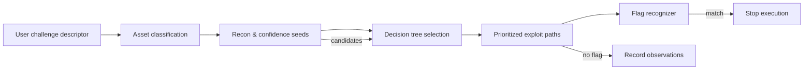

# ctf-autopwn — deterministic CTF exploitation toolkit

ctf-autopwn automates vulnerability discovery and exploitation by weaving together rule-based decision trees, deterministic probes, and adaptive exploit prioritization. There are no LLMs or randomness; every action is justified by evidence collected from adapters and recorded in the execution log.

## Quickstart

### Docker (local development or DigitalOcean deployment)

1. Build the container image with all bundled tools:

   ```powershell
   docker compose build autopwn-api
   ```

2. Start the service (runs the API, dashboard, and solver engine):

   ```powershell
   docker compose up -d
   ```

3. Confirm the service is healthy:

   ```powershell
   curl http://localhost:8000/health
   ```

4. Submit a challenge via the API or dashboard (`http://localhost:8000`), e.g.:

   ```http
   POST /solve
   Content-Type: application/json

   {
     "name": "Bank Login",
     "challenge_type": "web",
     "url": "http://target.com:8080",
     "flag_format": "flag{...}"
   }
   ```

5. Tail the logs to observe progress:

   ```powershell
   docker compose logs -f autopwn-api
   ```

   The logs show decision nodes, payloads, captured confidence, and any flag recognition events.

When deploying to DigitalOcean, build the same Docker image and push it to your container registry; the compose file can be used inside a droplet or managed App Platform by providing port 8000 and persistence for `/data`.

### Local (source)

1. Install dependencies:

   ```powershell
   python -m pip install -e .
   ```

2. Run the API:

   ```powershell
   uvicorn ctf_autopwn.api.server:app --host 0.0.0.0 --port 8000
   ```

3. Open `http://localhost:8000` to interact with the dashboard or issue `ctf-autopwn` CLI commands.

## Architecture

ctf-autopwn is composed of the following layers:

1. **Core orchestration** — `core/` defines shared data types (`ChallengeDescriptor`, `NodeResult`), the DecisionNode base class, a knowledge base for vulnerability archetypes, the orchestrator, and the flag recognizer.
2. **Adapters** — Tool adapters (curl, ffuf, nmap, etc.) wrap command-line utilities to emit normalized JSON so decision nodes can reason about structured observations.
3. **Decision trees** — Split between Python nodes (`trees/`) and YAML-driven trees (`ctf_autopwn/trees/yaml/`). Detection and exploitation paths read context, emit confidence boosts, and branch deterministically.
4. **Execution engine** — `ctf_autopwn/core/executor.py` drives YAML trees, runs HTTP probes, applies exploit payloads, and checks flag patterns after every response.
5. **API + UI** — `ctf_autopwn/api/server.py` exposes REST endpoints, persists run history (SQLite), and hosts the cyberpunk dashboard for live tree playback.



## File Structure (high-level)

| Path | Purpose |
|------|---------|
| `core/` | Shared orchestration logic, flag recognition, node abstractions, knowledge base. |
| `adapters/` | Tool adapters (curl, ffuf, nmap, gdb wrappers) that return structured dictionaries. |
| `trees/` | Legacy Python decision trees for reconnaissance, SQLi, SSTI, etc. |
| `ctf_autopwn/trees/yaml/` | YAML-based detection/exploitation definitions (plug-and-play). |
| `api/` | FastAPI server, REST endpoints, dashboard static assets. |
| `templates/` | Exploit helper templates (ROP chains, RSA attacks) consumed by nodes. |
| `config.py` | Global constants (flag regexes, tool paths, feature flags). |
| `mvp.py` | Top-level solver loop that stitches asset classification, YAML dispatch, and legacy nodes. |

## How it works

1. **Input ingestion** — The user submits a `ChallengeDescriptor` containing type, URL/file, flag format, and metadata.
2. **Asset classification** — Asset nodes classify the challenge (network, file, web) to narrow applicable trees.
3. **Confidence seeding** — Recon nodes populate context (paths, params, tech stack), and seeds boost tree confidence before detection.
4. **Decision tree dispatch** — YAML trees define `applies_when`, `confidence_seeds`, `detection_paths`, and `exploitation_paths`. Each detection step runs HTTP probes with payload permutations, checks response signals, and emits named events.
5. **Exploit prioritization** — Exploitation paths include ordered payload sets (high → medium → low confidence) and respect `stop_on_flag`. The executor records responses, checks `flag_recognizer`, and supports fallback capture values from YAML.
6. **Observation tracking** — Every request, payload, and outcome is logged, enabling the UI to display discoveries, payload attempts, and raw JSON state.
7. **Human-in-the-loop** — When automation is insufficient, the system escalates via `core/human_loop.py`, notes hints, and awaits user overrides.

## Testing

All Python test scripts now live under `tests/`. Run the suite with:

```powershell
pytest tests/
```

The directory contains deployment, API, and exploitation-tree verifiers that import the core modules and adapters without external network dependencies.

## Prompt blueprint for AI researchers

The following prompt outlines how to instruct an AI researcher to discover new TTPs and encode them as YAML decision trees. Include these details in your own research notes, but do **not** run the prompt inside ctf-autopwn:

> You are a CTF exploit researcher and decision tree author. Your job is to search the internet for real-world attack techniques, CTF write-ups, and security TTPs, then encode them as executable YAML decision trees for the `ctf-autopwn` framework.  
>  
> Search for CTF-relevant exploitation techniques across these categories. For each technique, find real write-ups (HackTheBox, TryHackMe, CTFtime, GitHub), OWASP test cases, PayloadsAllTheThings entries, HackTricks docs, Exploit-DB entries, and PortSwigger labs.  
>  
> Priority techniques include SSTI (Jinja2, Twig, Freemarker, Pebble), SSRF, open redirect, path traversal, XXE, IDOR, JWT attacks, broken access control, CSRF, HTTP request smuggling, GraphQL injection, deserialization, ret2libc, heap exploits, padding oracles, weak RNG, RSA small-e/Wiener attacks, LSB stego, metadata extraction, binwalk, PCAP analysis, and reverse engineering.  
>  
> Record existing YAML trees to avoid duplication (e.g., `web_sqli`, `web_lfi`, `web_cmdi`, `web_xss`).  
>  
> Follow the exact schema provided by ctf-autopwn: metadata (id, name, category, version, author, description), `applies_when`, `min_confidence`, `stop_on_flag`, `confidence_seeds`, `detection_paths`, and `exploitation_paths` with ordered steps, payload permutations, and signal matching instructions.

Adhering to this blueprint ensures community research contributions can be translated into yaml files that the engine can consume immediately.
